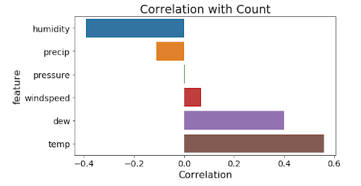
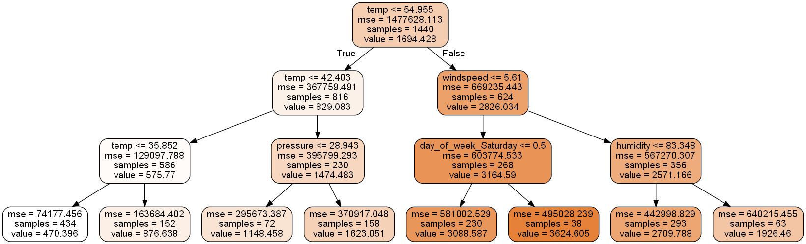
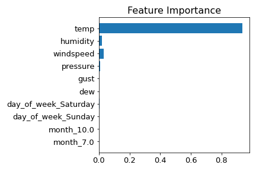

## Outline
(TO DO - Edit the outline)

- [Background](#Background)
- [Introduction](#Introduction)
- [Objectives](#Objectives)
- [Visualize the impact of COVID-19](#Visualize-the-impact-of-COVID-19)
- [Exploratory data analysis](#Exploratory-data-analysis)
- Regression model
- [Tree based model](#Tree-based-Model)
- [To-do](#To-do)

## 1. Introduction

The coronavirus disease-19 (COVID-19) pandemic radically changed the lives of many people, including those living in Madison, Wisconsin. In March 2020, Governor Tony Evers issued a stay-at-home order and prompted schools to move to online instruction. With almost everyone staying home for most of the day, many public facilities such as public transportation and academic and office buildings saw a change in their usage. 

As schools, offices, and many other places people regularly visited closed, fewer people needed to commute during the day and hence transportation may have become affected by the pandemic, including bicycle or bike usage. People were advised to avoid using public transportation such as buses. As a result, more people may have become more inclined to use their own mode of transportation such as their bicycles. The purpose of this report is to investigate this hypothesis. 

To help the City of Madison better identify and understand any changes in bicycle usage and the utilisation of bike paths in Madison due to the COVID-19 pandemic, this project examines factors that may contribute to these changes. These factors include the weather, seasonal variation, major events, and COVID-19 cases. In the end, this project creates a model that can take the pandemic into account and predict bike path usage in Madison in the near future to help the City of Madison make plans and policies regarding bicycles and bike paths in the city.

## 2. Historical Bike Traffic

(TO DO - Display data from years before 2020. Use plots from our first presentation.)

## 3. Bike Utilization Factors

There are possibly many factors that contribute to bike utilization. This project explored weather variables, namely rain/precipitation, snow, humidity, air pressure, temperature, and windspeed.

After plotting the heatmap between numerical variables and the target variable (Count), we started to build simple linear regression to check if there is a linear relationship between each numerical variable and Count. The red lines in the scatter plots represent a simple linear regression fit. We can see both wind speed and gust follow a linear model, but have some outliers we may want to look into. For instance, there are multiple days with less than 20 new cases but have suspiciously high user counts, which is around 6000. We can see similar behavior in temp and dew both follow more of a quadratic fit. 

Then I took the difference between prediction and the true value to examine the distribution of errors. It turns out that the error tends to have a smaller variance when the wind speed and gust have a larger value. It implies that the prediction will be more stable when the input value of wind speed and gust are large. The error of temp and dew are not evenly distributed around the horizontal line, especially when the temp and dew have a small value, which results from the failure of linear regression in these two cases. 

> Week 11/02 (Haoming)

  
   

  
   

## 4. Modeling

### 4.1. Multiple Linear Regression

Having determined the factors that contribute to bicycle usage in Madison, a model can start to be developed. Figure 4 shows a comparison between the actual bike usage data in 2019 and the predicted results using a multiple regression model.

(TO DO - Display plots showing the MR model trained on 2015-2017 data.)
(TO DO - Display plots showing the MR model trained on 2018-2020 data.)

Tested in this dataset, this model has a coefficient of determination or R^2 score of 0.78. This is not a very accurate model since some predicted values are off by a margin and can even be negative values, but it does a decent job of predicting and capturing the pattern in the dataset.

### 4.2. Polynomial Ridge Regression

Some nonlinear relationships between variables were identified, so we decided to change the model from a multiple linear regression to a polynomial ridge regression with a polynomial degree of 2. The 2nd degree polynomial transformation is done to allow the model to express the quadratic relationship between variables. The model was trained using data from 2015-2017 and tested on data from 2018-2020. We wanted to see how the model will perform when accounting for COIVD-19 cases.

(TO DO - Display plots showing the PR model trained on 2015-2017 data.)
(TO DO - Display plots showing the PR model trained on 2018-2020 data.)

The model performs better when there are no COVID-19 cases. It is 86% accurate when predicting the data in 2018 but only 73% accurate when predicting the data in 2020. This means that COVID-19's impact to bike usage is relatively small yet cannot be ignored. 

We will improve this model and then use it to predict several different outcomes by anticipating 3 different COVID-19 scenarios: rise, stagnation, and decline.

## 2. Visualize the impact of COVID-19

Questions
- Whether COVID19 has a notable impact on the bike usage level
- Whether COVID19 has a consistent impact on different bike paths 
- What causes the COVID19 to show the disparate effect on different bike paths (Internal factors: User composition. External factors: Location of bike path and availability of other transportation)

In the following scatter plots and histogram, we take the difference of bike user counts between 2020 and 2019. It can be seen that Captial was almost unaffected by the COVID-19, while bike users decline to some extent at Monroe Street.

The user composition is one of the possible reasons that could explain the difference behind those two locations.
Captial has a larger gap between weekend and weekday during the daytime (shadowed area), whereas Monroe has a smaller gap. We believe the cyclists are the primary driving force for this larger gap. We conclude that Captial has a relatively high percentage of cyclists and a low percentage of commuters, but it is the other way around at Monroe. Moreover, cyclists are more resilient during the COVID-19 crisis since cycling is compatible with social distancing. Therefore, the higher the portion of cyclists and the lower the portion of commuter, the more resilient the bike path will be during the COVID-19.

### Tree based Model
> Week 10/19 (Haoming)

We then tried a different approach to make the prediction and we will compare the performance of tree-based models against linear regression later. I only show the first three layers of the decision tree simply because the plot of a deeper tree cannot fit into the screen. It can be seen that the temp variable is used as the primary splitting criterion in the first layer and is also used multiple times in the following layer, which indicates the importance of temp in separating the target variable.  

Although the correlations are giving a good overview of the most important numeric variables and multicollinearity among those variables, I wanted to get an overview of the most important variables including the categorical variables.

The feature importance is calculated by its total contribution in decreasing the weighted impurity. In the context of the regression problem, the impurity is measured by the Mean Square Error within a node. The result of the tree-based model is almost consistent with the result of multiple linear regression, where weather information plays a dominant role in making prediction and information involves covid-19 are less determinant in both models. 

## Data sources

The data used for this analysis are collected from public online sources. 

- [Weather1](https://www.wunderground.com/history/daily/us/wi/madison/KMSN/date/2017-7-5)
- [Weather2](https://www.ncdc.noaa.gov/cdo-web/confirmation)
- [Covid cases](https://cityofmadison.maps.arcgis.com/apps/opsdashboard/index.html#/e22f5ba4f1f94e0bb0b9529dc82db6a3)

## To-do

⋅⋅* Data
1. Find the availability of other public transportations (bus), 
2. Add variables that can describe people's attitude towards COVID-19
3. Add government response to the COVID-19 (For example: Reopen plan and stay-at-home order)

⋅⋅* Model
1. Run Random Forest models with and without covid-related variables on two locations. As a result, there will be four models in total.
2. Evaluate the performance of models within each location and examine the importance and contribution of covid-related factors to the accuracy of the tree-models
3. Check whether the result from tree models are consistent with the regression models

