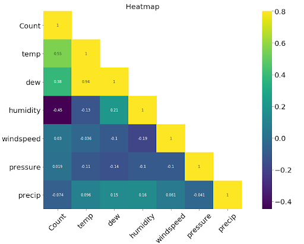

## Outline

- [Background](#Background)
- [Introduction](#Introduction)
- [Objectives](Objectives)
- Visualize the impact of COVID-19
- Exploratory data analysis
- Regression model
- [Tree-based model](#Tree based Model)
- [Conclusions](#Conclusion)
- [To-do](#To-do)

## Background

The restrictions put in place to limit the diffusion and impacts of Covid-19 have had a widespread impact on people’s lives, and the way energy is used across entire economies.

One of the biggest impacts has been the reduction in passenger transport demand, due to a combination of government lockdowns and fears of contracting and spreading the virus when using mass transport modes. Therefore, a key question for the energy sector is whether changes to transport behaviours during the crisis may result in a permanent change in behaviour (and transport energy use) or if transport patterns will revert to ‘business as usual’ when the crisis ends. 

If and when demand for passenger transport returns to pre-crisis levels will depend on a range of factors including perception of risk, cost, convenience, and the availability of alternative transport modes, all of which affect people’s mobility decisions.

## Introduction

To help the City of Madison better identify and understand any changes in bicycle usage and the utilisation of bike paths in Madison due to the COVID-19 pandemic, this project will examine factors that may contribute to these changes. These factors include the weather, seasonal variation, major events, COVID-19 cases, and deaths related to the pandemic. 

Moreover, we will conduct a comparative analysis to see whether the COVID19 has a significant impact on the bike usage level in two popular bike paths. If so, we also want to find out how does the impact of COVID-19 varies from location to location?

In the end, this project will create multiple genres of model that can take the pandemic into account and predict bike path usage in Madison in the near future to help the City of Madison make plans and policies regarding bicycles and bike paths in the city.

## Objectives

- Determine what factors may contribute to the change in bike path usage
- Determine the significance of each factor, especially COVID-19, in changing the bike path usage in Madison
- Determine the causes for the different impact of COVID-19 on two distinct bike paths
- Develop models to predict bicycle path usage in the near future

## Visualize the impact of COVID-19

Questions
- Whether COVID19 has notable impact on the bike usage level
- Whether COVID19 has consistent impact on different bike paths 
- What causes the COVID19 to show disparate effect on different bike paths (Internal factors: User composition. External factors: Location of bike path and availability of other transporation)

## Exploratory data analysis

> Week 10/12 (Haoming)

We first plot the distribution of target variable bike users count with histogram, probability plot, and box plot.

## Preliminary Data Modeling

> Week 10/19 (Haoming)

After plotting the heatmap between numerical variables and the target variable (Count), we started to build simple linear regression to check if there is a linear relationship between each numerical variable and Count. The red lines in the scatter plots represent a simple linear regression fit. We can see both wind speed and gust follow a linear model, but have some outliers we may want to look into. For instance, there are multiple days with less than 20 new cases but have suspiciously high user counts, which is around 6000. We can see similar behavior in temp and dew both follow more of a quadratic fit. 

Then I took the difference between prediction and the true value to examine the distribution of errors. It turns out that the error tends to have a smaller variance when the wind speed and gust have a larger value. It implies that the prediction will be more stable when the input value of wind speed and gust are large. The error of temp and dew are not evenly distributed around the horizontal line, especially when the temp and dew have a small value, which results from the failure of linear regression in these two cases. 

### Multiple Linear Regression

> Week 10/18 (Ian)

Having determined the factors that contribute to bicycle usage in Madison, a model can start to be developed. Figure 4 shows a comparison between the actual bike usage data in 2019 and the predicted results using a multiple regression model.

Tested in this dataset, this model has a coefficient of determination or R^2 score of 0.78. This is not a very accurate model since some predicted values are off by a margin and can even be negative values, but it does a decent job of predicting and capturing the pattern in the dataset.

### Tree based Model
> Week 10/19 (Haoming)

We then tried a different approach to make the prediction and we will compare the performance of tree-based models against linear regression later. I only show the first three layers of the decision tree simply because the plot of a deeper tree cannot fit into the screen. It can be seen that the temp variable is used as the primary splitting criterion in the first layer and is also used multiple times in the following layer, which indicates the importance of temp in separating the target variable.  

Although the correlations are giving a good overview of the most important numeric variables and multicollinearity among those variables, I wanted to get an overview of the most important variables including the categorical variables.

The feature importance is calculated by its total contribution in decreasing the weighted impurity. In the context of the regression problem, the impurity is measured by the Mean Square Error within a node. The result of the tree-based model is almost consistent with the result of multiple linear regression, where weather information plays a dominant role in making prediction and information involves covid-19 are less determinant in both models. 

### Polynomial Ridge Regression
> Week 10/26 (Ian)

Some nonlinear relationships between variables were identified, so we decided to change the model from a multiple linear regression to a polynomial ridge regression with a polynomial degree of 2. The 2nd degree polynomial transformation is done to allow the model to express the quadratic relationship between variables. The model was trained using data from 2015-2017 and tested on data from 2018-2020. We wanted to see how the model will perform when accounting for COIVD-19 cases.

The model performs better when there are no COVID-19 cases. It is 86% accurate when predicting the data in 2018 but only 73% accurate when predicting the data in 2020. This means that COVID-19's impact to bike usage is relatively small yet cannot be ignored. 

We will improve this model and then use it to predict several different outcomes by anticipating 3 different COVID-19 scenarios: rise, stagnation, and decline.

## Data sources

The data used for this analysis are collected from public online sources. 

- [Weather1](https://www.wunderground.com/history/daily/us/wi/madison/KMSN/date/2017-7-5)
- [Weather2](https://www.ncdc.noaa.gov/cdo-web/confirmation)
- [Covid cases](https://cityofmadison.maps.arcgis.com/apps/opsdashboard/index.html#/e22f5ba4f1f94e0bb0b9529dc82db6a3)

> To-do

⋅⋅* Data
1. Find the availablity of other public transporation (bus), 
2. Add variables that can describe people's attitude towards COVID-19
3. Add government response to the COVID-19 (For example: Reopen plan and stay-at-home order)

⋅⋅* Model
1. Run Random Forest models with and without covid-related variables on two locations. As a result, there will be four models in total.
2. Evaluate the performance of models within each location and examine the importance and contribution of covid-related factors to the accuracy of the tree-models
3. Check whether the result from tree models are consistent with the regression models

