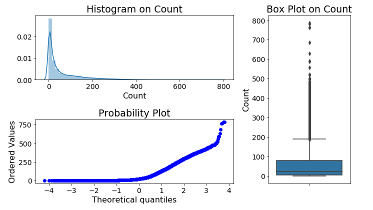

# 

## Background

The restrictions put in place to limit the diffusion and impacts of Covid-19 have had a widespread impact on people’s lives, and the way energy is used across entire economies.

One of the biggest impacts has been the reduction in passenger transport demand, due to a combination of government lockdowns and fears of contracting and spreading the virus when using mass transport modes. Therefore, a key question for the energy sector is whether changes to transport behaviours during the crisis may result in a permanent change in behaviour (and transport energy use) or if transport patterns will revert to ‘business as usual’ when the crisis ends. 

## Objectives

- Determine what factors may contribute to the change in bike path usage
- Determine the significance of each factor, especially COVID-19, in changing the bike path usage in Madison
- Develop a model to predict bicycle path usage in the near future

## Data sources

The data used for this analysis are collected from public online sources. 

- [Weather1](https://www.wunderground.com/history/daily/us/wi/madison/KMSN/date/2017-7-5)
- [weather2](https://www.ncdc.noaa.gov/cdo-web/confirmation)
- [Covid cases](https://cityofmadison.maps.arcgis.com/apps/opsdashboard/index.html#/e22f5ba4f1f94e0bb0b9529dc82db6a3)

## Exploratory data analysis

> Week 10/12 (Haoming)

We first plot the distribution of target varibale bike users count with histogram, probability plot, and box plot.

