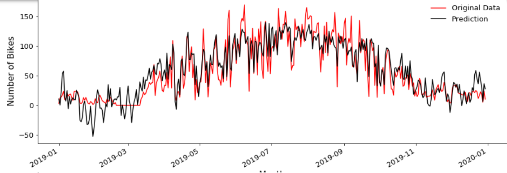
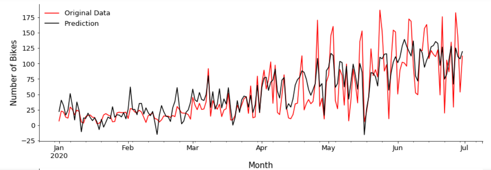
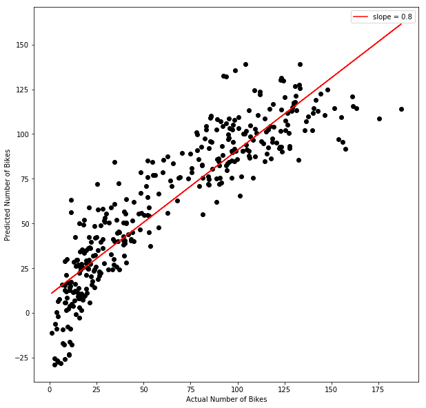
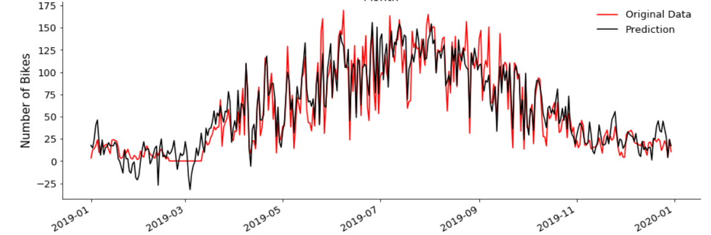
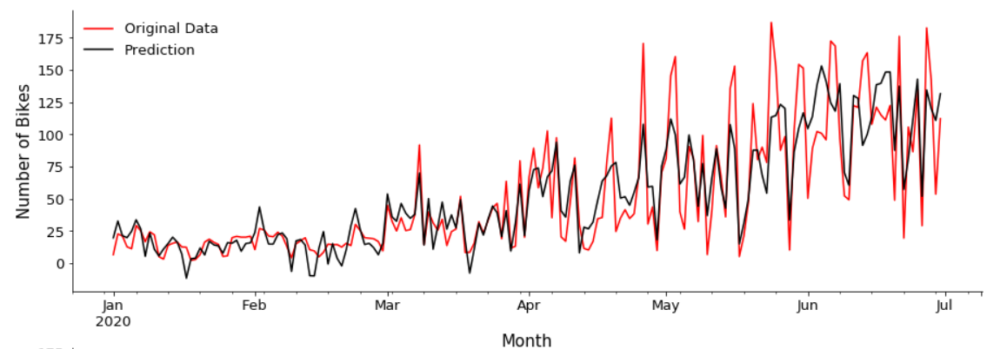
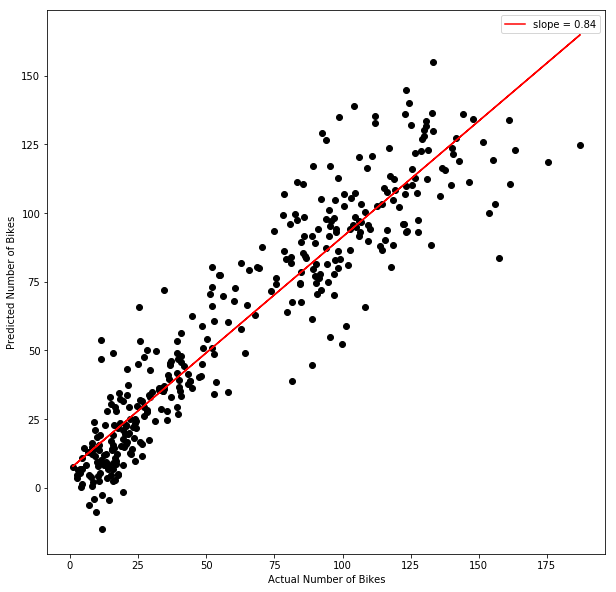

## Outline
(TO DO - Edit the outline)

- [Background](#Background)
- [Introduction](#Introduction)
- [Objectives](#Objectives)
- [Visualize the impact of COVID-19](#Visualize-the-impact-of-COVID-19)
- [Exploratory data analysis](#Exploratory-data-analysis)
- Regression model
- [Tree based model](#Tree-based-Model)
- [To-do](#To-do)

## 1. Introduction

The coronavirus disease-19 (COVID-19) pandemic radically changed the lives of many people, including those living in Madison, Wisconsin. In March 2020, Governor Tony Evers issued a stay-at-home order and prompted schools to move to online instruction. With almost everyone staying home for most of the day, many public facilities such as public transportation and academic and office buildings saw a change in their usage. 

As schools, offices, and many other places people regularly visited closed, fewer people needed to commute during the day and hence transportation may have become affected by the pandemic, including bicycle or bike usage. People were advised to avoid using public transportation such as buses. As a result, more people may have become more inclined to use their own mode of transportation such as their bicycles. The purpose of this report is to investigate this hypothesis. 

To help the City of Madison better identify and understand any changes in bicycle usage and the utilisation of bike paths in Madison due to the COVID-19 pandemic, this project examines factors that may contribute to these changes. These factors include the weather, seasonal variation, major events, and COVID-19 cases. In the end, this project creates a model that can take the pandemic into account and predict bike path usage in Madison in the near future to help the City of Madison make plans and policies regarding bicycles and bike paths in the city.

## 2. Historical Bike Traffic

(TO DO - Display data from years before 2020. Use plots from our first presentation.)

## 3. Bike Utilization Factors

There are possibly many factors that contribute to bike utilization. This project explored weather variables, namely rain/precipitation, snow, humidity, air pressure, temperature, and windspeed.

After plotting the heatmap between numerical variables and the target variable (Count), we started to build simple linear regression to check if there is a linear relationship between each numerical variable and Count. The red lines in the scatter plots represent a simple linear regression fit. We can see both wind speed and gust follow a linear model, but have some outliers we may want to look into. For instance, there are multiple days with less than 20 new cases but have suspiciously high user counts, which is around 6000. We can see similar behavior in temp and dew both follow more of a quadratic fit. 

Then I took the difference between prediction and the true value to examine the distribution of errors. It turns out that the error tends to have a smaller variance when the wind speed and gust have a larger value. It implies that the prediction will be more stable when the input value of wind speed and gust are large. The error of temp and dew are not evenly distributed around the horizontal line, especially when the temp and dew have a small value, which results from the failure of linear regression in these two cases. 

> Week 11/02 (Haoming)

In this section, we explore feature importance at two bike path locations (Capital and Monroe).  The following figure shows how factors' coefficients change with the penalty term assigned in the Lasso regression model. We observe that the trend displays three remarkable differences regarding feature importance between these two locations. 

  
   

First of all, other than season and month factors, the year factor (2020) also has a large absolute coefficient at Monroe when we assign a smaller penalty to the model. Indeed, the year 2020 has double meanings in this context. The year 2020 not only represents a calendar year but also indicates the existence of covid-19 as a boolean type variable. On the contrary, we don't see any covid-related variables that have a profound impact on the model at the Capital.

Moreover, when we increase the penalty term to 100, all the coefficients converge to zero at Monroe. However, max_temp and wind speed at the Capital is not affected by the penalty term at all, since these two variables display a nearly horizontal line throughout the plot. Their resilience against the penalty force indicates their outstanding contribution to the model at the Capital.

Last but not least, in the range between 10 to 40 of penalty at Monroe, we can see the green line which represents the positive rate remains an important factor in the model.
Combined with the earlier analysis of the Year 2020, we can conclude that covid-19 have a strong influence on the bike user's behavior at Monroe, while weather-related information such as temperature and windspeed dominates the model at the Capital, which makes covid-19 less significant in that case. 

To confirm the aforementioned conclusion about the importance of weather information at Capital, we also check the heatmap with the correlation between predictors and the target variable.

  
   

We observe that temp and dew tend to have a strong correlation (around 0.85) with Counts at Capital, while the correlation between them and Counts is around 0.45. These numbers substantiate the conclusion we made above that temp and windspeed are much more influential than other variables in the model of Capital. 

> Week 11/09 (Haoming)

  

In our predictive model, we have around 60 variables for prediction and some of them are highly correlated, such as 7-day average cases, 14-day average cases. Those many factors may cause a problem of overfitting and also violate the assumption of independence between variables in the linear regression model.

We select the first 10 principal components in the model since the rest of the principal components only make minor contributions to the explained variance. The first two principal components can explain around 14% of the variance. Inspired by that, we want to explore how the principal components are connected with the original factors in the following plot. 

  

To interpret each principal component, we examine the magnitude and direction of the coefficients for the original variables. The larger the absolute value of the coefficient, the more important the corresponding variable is in calculating the component.

The first principal component is strongly correlated with four of the original variables. The first principal component increases with increasing Tests, Year 2020, Temperature, and Season summer. This suggests that these four criteria vary together. 

## 4. Modeling Bike Utilization

### 4.1. Multiple Linear Regression

Having determined the factors that contribute to bicycle usage in Madison, a model can start to be developed. Figure [] shows a comparison between the actual bike usage data and the predicted results in 2019 and 2020 using a multiple regression model. The model was trained using data from 2015 to 2017.

This model could predict the data in 2019 with an 83% accuracy, while it could only achieve 73% accuracy when predicting data in 2020. This suggests that COVID-19 has had a relatively small yet not insignificant effect on bike utilization in Madison. As a result, COVID-19 data needed to be incorporated into the model training. Figure [] shows the performance of the model when predicting data in 2017 after being trained using data from 2018 to 2020.

Tested in this dataset, this model has an accuracy of 82%. For a perfect model, the slope would be 1.0, which indicates a perfect correlation. The 0.8 slope in figure [] indicates that the model has a low bias and regularly underestimates the number of bikes.

### 4.2. Polynomial Ridge Regression

Some nonlinear relationships between variables were identified, so we decided to change the model from a multiple linear regression to a polynomial ridge regression with a polynomial degree of 2. The 2nd degree polynomial transformation is done to allow the model to express the quadratic relationship between variables. We wanted to see how the model will perform when accounting for COVID-19 cases. Figure [] shows a comparison between the actual bike usage data and the predicted results in 2019 and 2020 using a polynomial ridge regression model. The model was trained using data from 2015 to 2017.

This model performs better than the multiple regression model, yielding an accuracy of 88% in 2019 and 76% in 2020. Like the multiple regression model, this model also performs better when there are no COVID-19 cases. This further emphasizes that COVID-19's impact to bike usage cannot be ignored. Figure [] shows the performance of the model when predicting data in 2017 after being trained using data from 2018 to 2020.

Tested in this dataset, this model has an accuracy of 86%. The 0.84 slope in figure [] indicates that the model is better at predicting than the multiple regression model, but it still has a low bias and regularly underestimates the number of bikes.
## 5. The Impact of COVID-19

Questions
- Whether COVID19 has a notable impact on the bike usage level
- Whether COVID19 has a consistent impact on different bike paths 
- What causes the COVID19 to show the disparate effect on different bike paths (Internal factors: User composition. External factors: Location of bike path and availability of other transportation)

In the following scatter plots and histogram, we take the difference of bike user counts between 2020 and 2019. It can be seen that Captial was almost unaffected by the COVID-19, while bike users decline to some extent at Monroe Street.

The user composition is one of the possible reasons that could explain the difference behind those two locations.
Captial has a larger gap between weekend and weekday during the daytime (shadowed area), whereas Monroe has a smaller gap. We believe the cyclists are the primary driving force for this larger gap. We conclude that Captial has a relatively high percentage of cyclists and a low percentage of commuters, but it is the other way around at Monroe. Moreover, cyclists are more resilient during the COVID-19 crisis since cycling is compatible with social distancing. Therefore, the higher the portion of cyclists and the lower the portion of commuter, the more resilient the bike path will be during the COVID-19.

## 6 Model Diagnostics
> Week 11/16 (Haoming)

  

  

In this bar plot, we are trying to evaluate the performance of four different models used for the bike counts prediction. Within each algorithm, including Lasso, Ridge, Random Forest (rf), Gradient Boosting (gbr), we first select the optimal set of hyperparameters and then use 12-fold cross-validation to assess the model performance on the holdout dataset in each iteration. The height of the bar represents the average of explained variance while the error bar represents the standard deviation of the explained variance for the 12-fold cross-validation. It can be seen that the tree-based methods, such as rf and gbr, have better performance compared to linear models. However, those tree-based models also suffer from high computation costs and lower interpretability.

  
   
   

We select a representative model from the tree-based model and linear model respectively to diagnose the bias and variance trade-off. The red lines in both plots represent the explained variance score on the training set, while the green lines represent the explained variance score on the test set. Not surprisingly, the explained variance score on the training set is always higher than that of the test set, because the model will memorize some noise inherent in the data in the training process. One remarkable difference between the linear model and tree-based model is that there is a larger gap between these two lines in the random forest and a smaller gap in the Ridge. A larger gap indicates a problem of overfitting since random forest only achieve high explained variance on the training set, but a relatively low explained variance score on the test set. On the contrary, the linear model suffers a high bias problem. That's because even the explained variance score on the training set is around 0.82 and that score will be even lower on the test set. Another finding is that collecting more data might be helpful in the case of a tree-based model but that is not true for the linear model. The green line keeps increasing as the number of training examples increases in the random forest. However, the green line in the Ridge plot has already struck at the current point and is also bounded by the red line above. Therefore, we conclude the linear model almost reaches its full capacity, and collecting more data won't improve the performance of the linear model that much. But there is room for improvement for the tree-based model if more data is available.  

## 7. Predicting Bike Utilization in the Near Future

Having developed models to visualize bike utilization, we can use them to predict bike utilization in the near future. Due to the lack of weather forecasts for Madison in 2021, we assumed that the weather in 2021 will be similar to that in 2017. Both the multiple regression model and the polynomial ridge model were used to predict bike utilization in 3 different COVID-19 scenarios: steady decline, stagnation, and steady increase, shown in Figures [], [], and [], respectively.

### Tree based Model
> Week 10/19 (Haoming)

We then tried a different approach to make the prediction and we will compare the performance of tree-based models against linear regression later. I only show the first three layers of the decision tree simply because the plot of a deeper tree cannot fit into the screen. It can be seen that the temp variable is used as the primary splitting criterion in the first layer and is also used multiple times in the following layer, which indicates the importance of temp in separating the target variable.  

Although the correlations are giving a good overview of the most important numeric variables and multicollinearity among those variables, I wanted to get an overview of the most important variables including the categorical variables.

The feature importance is calculated by its total contribution in decreasing the weighted impurity. In the context of the regression problem, the impurity is measured by the Mean Square Error within a node. The result of the tree-based model is almost consistent with the result of multiple linear regression, where weather information plays a dominant role in making prediction and information involves covid-19 are less determinant in both models. 

## Data sources

The data used for this analysis are collected from public online sources. 

- [Weather1](https://www.wunderground.com/history/daily/us/wi/madison/KMSN/date/2017-7-5)
- [Weather2](https://www.ncdc.noaa.gov/cdo-web/confirmation)
- [Covid cases](https://cityofmadison.maps.arcgis.com/apps/opsdashboard/index.html#/e22f5ba4f1f94e0bb0b9529dc82db6a3)

## To-do

⋅⋅* Data
1. Find the availability of other public transportations (bus), 
2. Add variables that can describe people's attitude towards COVID-19
3. Add government response to the COVID-19 (For example: Reopen plan and stay-at-home order)

⋅⋅* Model
1. Run Random Forest models with and without covid-related variables on two locations. As a result, there will be four models in total.
2. Evaluate the performance of models within each location and examine the importance and contribution of covid-related factors to the accuracy of the tree-models
3. Check whether the result from tree models are consistent with the regression models

