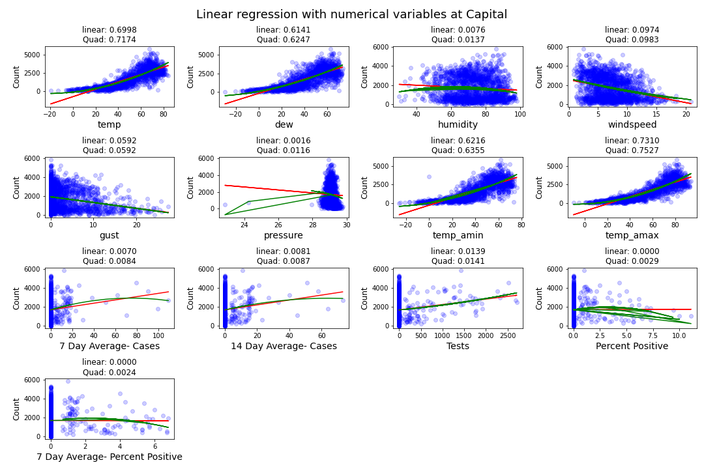
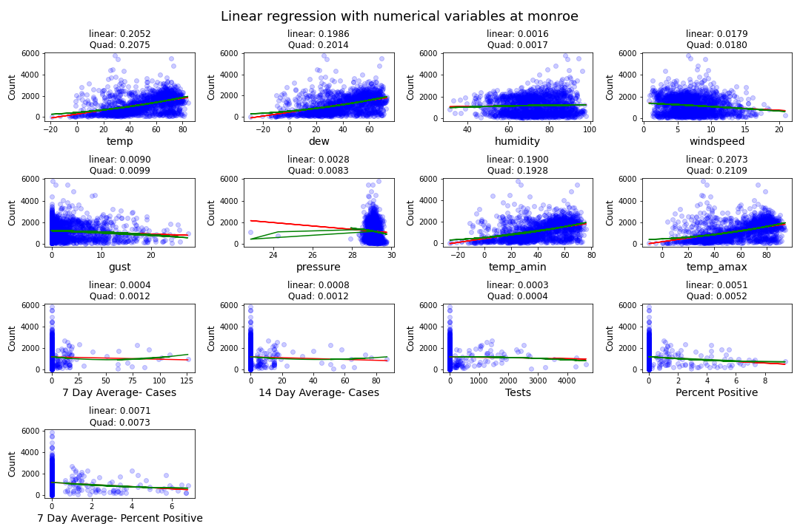

# Analysis of The Effects of COVID-19 on Bike Traffic in Madison, Wisconsin

Ian Cheng and Haoming Chen
University of Wisconsin - Madison

## 1. Introduction

The coronavirus disease-19 (COVID-19) pandemic radically changed the lives of many people, including those living in Madison, Wisconsin. In March 2020, Governor Tony Evers issued a stay-at-home order and prompted schools to move to online instruction [1]. As the vast majority of people staying home for most of the day, many public facilities such as public transportation and academic and office buildings experienced a change in their usage. As schools, offices, and many other places people regularly visited closed, fewer people needed to commute during the day and hence transportation may have become affected by the pandemic, including bike usage. People were advised to avoid using public transportation, such as buses. As a result, more people may change their transportation behaviors and become more inclined to use their own mode of transportation, such as their bicycles. Two bike trails in Madison are the main objects for this study: Capital Trail and Southwest Path or Monroe, shown in Figure 1. 

  
   
  <b>Figure 1. </b>Capital Trail (left) and Southwest Path / Monroe (right). Images from [2].

After examining historical bike traffic data, we found that although the daily number of bikes have not decreased as a result of the pandemic, there is a shift in the time which bikers use bike paths. After the pandemic started, most of the daily bike traffic is concentrated at around 4 PM on both bike paths. This could be a concern because more bikers would be using the paths at the same time.

We trained a Random Forest model to understand how COVID-19 has impacted bicycle utilization in Madison and predict bike utilization in the near future. The prediction result can help the City of Madison better manage public resourses in response to the change in the level of bike traffic. The model was trained on data from 2015 to 2020. We identified several factors that contributed to bike utilization: air temperature, humidity, rain, snow, and wind speed. Although the weather has the largest effect on bike utilization, we found a relatively slight and positive correlation between confirmed COVID-19 cases and the level of bike traffic on Capital Trail and a more moderate and negative correlation on Monroe.

We used our model to forecast utilization of bike paths in 2021 and concluded that the number of bikes on either bike paths will not likely change significantly. However, bike traffic may still be concentrated at around a specific time during the day.

## 2. Trends in Bike Traffic Before and During the COVID-19 Pandemic

Figure 2 shows that there is a shift in bike traffic during the day before and after the COVID-19 pandemic. More people start their commute later during the pandemic than before. 

  
   
  <b>Figure 2. </b> Hourly average number of bikes throughout the day with and without COVID-19 on Capital Trail (left) and Monroe (right). Data from [3].

There used to be two peaks throughout the day, but now there is only one. This means that bike traffic in Madison is concentrated around a certain time during the day. It seems that most people go out and ride their bikes at roughly the same time. The same trend can be seen when breaking up the data by season, shown in Figure 3.

  
    
  <b>Figure 3. </b> Hourly average number of bikes throughout the day with COVID-19 grouped by season before and after the COVID-19 pandemic started on Capital Trail (left) and Monroe (right). Only data until June 2020 are available. Data from [3].

The peak at around 8 AM is gone but the peak at around 4 PM still exists and is likely bigger. The peak during spring is larger during the pandemic than before the pandemic. Since data from July 2020 onwards, which includes the peak of summer in 2020, are not currently available, it is likely that the peak in the summer and the subsequent seasons during the pandemic is larger than before the pandemic.

Most of the bike riders on Capital Trail during the pandemic may have been doing so for leisure activities. Figure 4 and 5 show a much stronger correlation between bikers on the Capital Trail and pedestrians on State Street during the pandemic than before the pandemic. The number of pedestrians on State Street decreased and became much closer to the number of bikes. Given that most of riders are active at around 4 PM during the pandemic, they may also be pedestrians on State Street.

   
  <b>Figure 4. </b> Bike traffic on Capital Trail and pedestrian traffic on State Street before the COVID-19 Pandemic started. Data from [3]. 
    
  <b>Figure 5. </b> Bike traffic on Capital Trail and pedestrian traffic on State Street after the COVID-19 Pandemic started. Data from [3].

## 3. Bike Utilization Factors

We have around 50 factors after one-hot encoding and they can be split into numerical variables and categorical variables. Correlation analysis and simple linear regression will be conducted on the numerical variables to examine their relationship with the bike usage level. 

### 3.1 Numerical Variables

As for the numerical variables, we focused on COVID-19 and weather variables, including rain/precipitation, snow, humidity, air pressure, temperature, and windspeed because weather is one of the major factor in deciding what mode of transportation to use and it is easy to measure. Figure 6 shows a heat map displaying the correlations between the variables with each other at the two locations.

  
    
  <b>Figure 6. </b>Heat map of correlations between variables on Capital Trail (top) and Monroe (bottom). Data from [3], [4], [5].

We observe that temp and dew tend to have a strong correlation (around 0.85) with Counts at Capital, while the correlation between them and Counts is around 0.45. These numbers substantiate the conclusion we made above that temp and windspeed are much more influential than other variables in the model of Capital. 

After plotting the heatmap between numerical variables and the target variable (Count), we built a simple linear regression to check if there is a linear relationship between each numerical variable and Count, shown in Figures 7 and 8. The red lines in the scatter plots represent a simple linear regression fit. We can see both wind speed and gust follow closely with a linear model while temp and dew both follow more of a quadratic fit. 

   
  <b>Figure 7. </b>Linear regression with numerical variables on Capital Trail. Data from [3], [4], [5].

   
  <b>Figure 8. </b>Linear regression with numerical variables on Monroe. Data from [3], [4], [5].

Both correlation heatmap and simple linear regression plots suggest that temp and dew have a  remarkable impact on the level of bike usage at Capital, while such dominant factors don't exist at Monroe. We should keep in mind that the existence of such impactful factors at Captial may overshadow other predictors, such as COVID-19 related variables. Therefore, the strong impact of temperature and dew at Captial might be the driving force of the difference in the impact of COVID-19 between two bike paths. We will go back to this point again in **section 4.1**

### 3.2 Categorical Variables

In this section, we explored the relationship between level of bike traffic with some categorical variables, including season, day of week, hour, in/out of school session. Figure 9 shows the relationship between these categorical variables with the daily number of bikes.

   
  <b>Figure 9. </b>Relationship between categorical variables with daily bike ridership. Data from [3].

It can be seen that bike users are most active in summer and least active in the winter. We also observe a slightly higher level of bike usage during the weekend compared to the weekdays. The peak hour is usually around 7 - 8 am and 4 - 5 pm, which aligns with the rush hour for the commuters. Interestingly, we also find that there are more bike users during the winter or summer break in comparison with the regular school session. This phenomenon can be attributed to the high bike usage level during the long summer break which is displayed in the subplot in the upper-left corner. 

## 4. The Impact of COVID-19

In this section, we employed two methods to understand the impact of COVID-19. The first method is the lasso model where we examined how the coefficients of COVID-19 related variables change in response to the change in the magnitude of the penalty term. In the second method, we took a more straightforward strategy where we conducted a year-to-year comparison to display how the bike usage counts change in the Year 2020 compared to the previous year.  

### 4.1 Method 1 (Lasso Model)
We explored feature importance at two bike path locations (Capital and Monroe). Figure 10 shows how factors' coefficients change with the penalty term assigned in the Lasso regression model. We observe that the trend displays three remarkable differences regarding feature importance between these two locations. 

  
   
  <b>Figure 10. </b>Change in the coefficient for each factor with respect to penalty. Data from [3], [4], [5].

First of all, other than season and month factors, the year factor (2020) also has a large absolute coefficient at Monroe when we assign a smaller penalty to the model. Indeed, the year 2020 has double meanings in this context. The year 2020 not only represents a calendar year but also indicates the existence of COVID-19 as a boolean type variable. On the contrary, we don't see any COVID-related variables that have a profound impact on the model at the Capital.

Moreover, when we increase the penalty term to 100, all the coefficients converge to zero at Monroe, shown in Figure 6. However, max_temp and wind speed at the Capital is not affected by the penalty term at all, since these two variables display a nearly horizontal line throughout the plot. Their resilience against the penalty force indicates their outstanding contribution to the model at the Capital.

Last but not least, in the range between 10 to 40 of penalty at Monroe, we can see the green line which represents the positive rate remains an important factor in the model.
Combined with the earlier analysis of the Year 2020, we can conclude that COVID-19 have a strong influence on the bike user's behavior at Monroe, while weather-related information such as temperature and windspeed dominates the model at the Capital, which makes COVID-19 less significant in that case. 

Continued from the analysis in **section 3.1**, the lasso model also demonstrates that there exist influential factors at Capital but we couldn't find such at Monroe. These influential factors will overshadow other factors in the model and make them seem less significant. 

### 4.2 Method 2 (Year-to-year comparison)

In Figure 11, we took the difference in bike user counts between 2020 and 2019. It should be noted that the difference is aligned by day of the week when computing the difference to avoid taking the difference between a weekday and a weekend. The number on the upper left and lower left of each subplot represents the proportion of the positive and negative difference, respectively.  It can be seen that Capital was almost unaffected by the COVID-19, while bike users decline to some extent at Monroe Street. While the majority of points are evenly distributed around the horizontal line, there is an exception which is highlighted in yellow in the middle of both plots. It is interesting to see that we can only observe a negative difference in both locations for this extended period. This observation encourages us to discover some special events that might occur within these two weeks which could explain this exception and potentially become a great predictor of the level of bike traffic.
 

   
  <b>Figure 11. </b>Difference between bike ridership in 2019 and in 2020 on Monroe (left) and Capital Trail (right). Data from [3].

Figure 12 shows a cumulative distribution function (CDF) for the difference between 2020 and 2019. The blue which represents Capital trail is to the right of the orange line for Monroe trail. Given each percentile, we are likely to observe a larger difference at Capital compared to Monore. Moreover, while the 50th percentile (Median) is around 0 for the blue line, the orange line has a negative median value, which means a negative difference between 2020 and 2019. This plot proves that Capital trail has relatively more users than Monroe trail. 

   
  <b>Figure 12. </b>CDF of the difference in bike ridership in 2019 and in 2020. Data from [3].

## 5. Model Selection

Figure 13 shows an evaluation of the performance of four different models used for the bike counts prediction. Within each algorithm, including Lasso, Ridge, Random Forest (rf), Gradient Boosting (gbr), we first select the optimal set of hyperparameters and then use 12-fold cross-validation to assess the model performance on the holdout dataset in each iteration. The height of the bar represents the average of explained variance while the error bar represents the standard deviation of the explained variance for the 12-fold cross-validation. It can be seen that the tree-based methods, such as rf and gbr, have better performance compared to linear models. However, those tree-based models also suffer from high computation costs and lower interpretability.

   
  <b>Figure 13. </b>Average explained variances for lasso, ridge, gradient boosting, and random forest regression models

We selected a representative model from the tree-based model and linear model respectively to diagnose the bias and variance trade-off. The red lines in both Figure 14 represent the explained variance score on the training set, while the green lines represent the explained variance score on the test set. Not surprisingly, the explained variance score on the training set is always higher than that of the test set, because the model will memorize some noise inherent in the data in the training process. One remarkable difference between the linear model and tree-based model is that there is a larger gap between these two lines in the random forest and a smaller gap in the Ridge. A larger gap indicates a problem of overfitting since random forest only achieve high explained variance on the training set, but a relatively low explained variance score on the test set. On the contrary, the linear model suffers a high bias problem. That's because even the explained variance score on the training set is around 0.82 and that score will be even lower on the test set. Another finding is that collecting more data might be helpful in the case of a tree-based model but that is not true for the linear model. The green line keeps increasing as the number of training examples increases in the random forest. However, the green line in the Ridge plot has already struck at the current point and is also bounded by the red line above. Therefore, we conclude the linear model almost reaches its full capacity, and collecting more data won't improve the performance of the linear model that much. But there is room for improvement for the tree-based model if more data is available. 

  
   
    
  <b>Figure 14. </b>Explained variance as a function of number of training examples for random forest (left), lasso (middle), and polynomial lasso (right) regression models

## 6. Model Performance

We trained a random forest model on data from 2015 to 2020 and testes it on the same dataset. We found that the model is fairly accurate as it is able to learn the trends of the original dataset quite well. Figure 15 shows the comparison between the original bike data and the predicted values from the model.

   
  <b>Figure 15. </b>Comparison between the original bike data and the predicted values from the random forest model. Data from [3], [4], [5].

The model seems to have a slight low bias. Figure 16 shows that the predicted values are slightly lower than the actual values, represented by the slope, which is less than 1. This will be important to keep in mind when interpreting the forecasts made using the model as the results of the model will likely be lower than what they will actually be. 

   
  <b>Figure 16. </b>Linear regression between predicted and actual daily bike counts. Data from [3], [4], [5].

Looking at the importance of each factor used in the model, we found that COVID-19 cases is only slightly important compared to the other factors, while temperature seems to be the dominant variable that has the most influence on bike ridership. As a result, it is likely that the differences in daily bike ridership with or without COVID-19 cases are not significant. Figure 17 shows the importance of each variable on both bike paths. 

  
   
  <b>Figure 17. </b> Importance of each variable on Capital Trail (left) and Monroe (right). Data from [3], [4], [5].

It seems that COVID-19 is a bigger factor on Monroe than on Capital Trail. It only accounts for 0.22% of the variance in the model results on Capital Trail, while it accounts for 0.39% of the variance in the model results on Monroe.

## 7. Predicting Daily Bike Ridership in 2021

Having developed models to visualize bike utilization, we can use them to predict daily bike utilization in 2021. Since weather forecasts for 2021 are not available for this analysis, we estimated the weather in 2021 to be the average over 2015 to 2020. Figure 18 shows the daily bike count predictions in 2021 with 0 and 500 daily COVID-19 cases on both bike paths.

  
   
  <b>Figure 18. </b> Daily bike count predictions in 2021 with 0 and 500 daily COVID-19 cases on Capital Trail (top) and Monroe (bottom). Data from [3], [4], [5].

The discrepancies between the predicted number of bikes with and without COVID-19 cases in Figure ... align with the finding that COVID-19 has a relatively small and positive effect on bike traffic on Capital Trail and a slightly larger but negative effect on bike traffic on Monroe. However, the discrepancies are relatively small and therefore can be considered almost negligible.

## 8. Conclusions

Our research found that COVID-19 has a minuscule impact on daily bike ridership but a significant impact on the distribution of bike traffic throughout the day. COVID-19 cases affect bike ridership postively on Capital Trail but negatively on Monroe Path, and its effects are slightly larger on Monroe than Capital Trail. However, these effects are most likely unimportant when forecasting bike ridership in 2021 due to their extremely low importance in the Random Forest model used in this analysis. It is apparent, however, that the COVID-19 pandemic has caused daily bike traffic to be more concentrated at around 4 PM or possibly a similar time in the afternoon. This is likely a concern because bike paths will be more crowded than usual at around this time of the day.

Future studies should look more into into the relationship between bike traffic on Capital Trail and pedestrians on State Street. Our analysis has only been able to speculate that riders on Capital Trail may also be pedestrians on State Street. We found that the correlation between bike traffic on Capital Trail and pedestrians on State Street is much stronger after the pandemic started than before. Understanding how these two relate to each other will provide more insight, such as the destinations of bikers, for the City of Madison.

## 9. References

1. L. White. "Evers Administration Issues 'Stay-At-Home' Order For Wisconsin". [Online]. Available: https://www.wpr.org/evers-administration-issues-stay-home-order-wisconsin
2. Google Maps. [Online]. Available: https://www.google.com/maps
3. City of Madison. "City of Madison Open Data". [Online]. Available: https://data-cityofmadison.opendata.arcgis.com/
4. Weather Underground. [Online]. Available: https://www.wunderground.com/history/daily/us/wi/madison/KMSN/date/2017-7-5
5. National Oceanic and Atmospheric Administration (NOAA). [Online]. Available: https://www.ncdc.noaa.gov/cdo-web/confirmation

## Appendix

### PCA

   
  Figure 6

In our predictive model, we have around 50 variables for prediction and some of them are highly correlated, such as 7-day average cases, 14-day average cases. Those many factors may cause a problem of overfitting and also violate the assumption of independence between variables in the linear regression model.

We select the first 10 principal components in the model since the rest of the principal components only make minor contributions to the explained variance. The first two principal components can explain around 14% of the variance. Inspired by that, we want to explore how the principal components are connected with the original factors in Figure 7. 

   
  Figure 7

To interpret each principal component, we examine the magnitude and direction of the coefficients for the original variables. The larger the absolute value of the coefficient, the more important the corresponding variable is in calculating the component.

The first principal component is strongly correlated with four of the original variables. The first principal component increases with increasing Tests, Year 2020, Temperature, and Season summer. This suggests that these four criteria vary together. 

### User composition
The user composition is one of the possible reasons that could explain the difference behind those two locations. Capital has a larger gap between weekend and weekday during the daytime (shadowed area), whereas Monroe has a smaller gap, as shown in Figure 14. We believe the cyclists are the primary driving force for this larger gap. We conclude that Captial has a relatively high percentage of cyclists and a low percentage of commuters, but it is the other way around at Monroe. Moreover, cyclists are more resilient during the COVID-19 crisis since cycling is compatible with social distancing. Therefore, the higher the portion of cyclists and the lower the portion of commuter, the more resilient the bike path will be during the COVID-19.

   
  Figure 14

