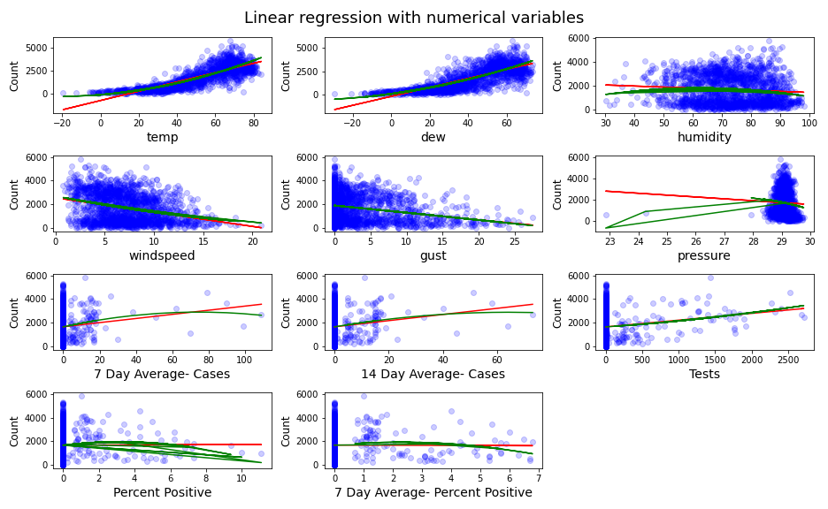

# Analysis of The Effects of COVID-19 on Bike Traffic in Madison, Wisconsin

## 1. Introduction

The coronavirus disease-19 (COVID-19) pandemic radically changed the lives of many people, including those living in Madison, Wisconsin. In March 2020, Governor Tony Evers issued a stay-at-home order and prompted schools to move to online instruction [1]. As the vast majority of people staying home for most of the day, many public facilities such as public transportation and academic and office buildings experienced a change in their usage. As schools, offices, and many other places people regularly visited closed, fewer people needed to commute during the day and hence transportation may have become affected by the pandemic, including bike usage. People were advised to avoid using public transportation, such as buses. As a result, more people may change their transportation behaviors and become more inclined to use their own mode of transportation, such as their bicycles. **Two bike trails in Madison are the main objects for this study.** *The main purpose of this report is to investigate how does the COVID-19 affect people's usage level of bikes at different locations.* 

  
   
  <b>Figure 1. </b> 
  

We trained **Random Forest models** to understand how COVID-19 has impacted bicycle utilization in Madison and predict bike utilization in the near future. The prediction result can help the City of Madison better manage public resourses in response to the change in the level of bike traffic. The model was trained on data from 2015 to 2020. We identified several factors that contributed to bike utilization more than the COVID-19 pandemic. These factors include the air temperature, humidity, rain, snow, seasonal variation. Although the weather has the largest effect on bike utilization, we found a slightly positive correlation between confirmed COVID-19 cases and the level of bike traffic.

We used our model to forecast utilization of bike paths in early 2021. (Three scenarios were taken into consideration: stagnation, increase, and decrease in COVID-19 cases or We assumed that the COVID-19 trend in early 2021 will be similar to that of the current trend in late 2020.)  

## 2. Trends in Bike Traffic Before and During the COVID-19 Pandemic

Figure 1 shows that there is a shift in bike traffic during the day before and after the COVID-19 pandemic. More people start their commute later during the pandemic than before. 

   
  <b>Figure 1. </b> Average number of bikes throughout the day with and without COVID-19

There used to be two peaks throughout the day, but now there is only one. This means that bike traffic in Madison is concentrated around a certain time during the day. It seems that most people go out and ride their bikes at roughly the same time. The same trend can be seen when breaking up the data by season, shown in Figures 2 and 3.

   
  <b>Figure 2. </b> Average number of bikes throughout the day without COVID-19 grouped by season.
    
  <b>Figure 3. </b> Average number of bikes throughout the day with COVID-19 grouped by season. Only data until June 2020 are available.

The peak at around 8 AM is gone but the peak at around 4 PM still exists and is likely bigger. The peak during spring is larger during the pandemic than before the pandemic. Since data from July 2020 onwards, which includes the peak of summer in 2020, are not currently available, it is likely that the peak in the summer during the pandemic is larger than before the pandemic.

Most of the bike riders during the pandemic may have been doing so for leisure activities. Figure 4 and 5 show a much stronger correlation between bikers on the Capital Trail and pedestrians on State Street during the pandemic than before the pandemic. The number of pedestrians on State Street decreased and became much closer to the number of bikes. Given that most of riders are active at around 4 PM during the pandemic, they may also be pedestrians on State Street.

   
  <b>Figure 4. </b> Bike and pedestrian traffic before the COVID-19 Pandemic 
    
  <b>Figure 5. </b> Bike and pedestrian traffic after the COVID-19 Pandemic

## 3. Bike Utilization Factors

We have around 50 factors after one-hot encoding and they can be split into numerical variables and categorical variables. Correlation analysis and simple linear regression will be conducted on the numerical variables to examine their relationship with the bike usage level. 

### 3.1 Numerical Variables

As for the numerical variables, we focused on COVID-19 and weather variables, including rain/precipitation, snow, humidity, air pressure, temperature, and windspeed because weather is one of the major factor in deciding what mode of transportation to use and it is easy to measure. Figure 2 shows a heat map displaying the correlations between the variables with each other at the two locations.

  
    
  Figure 2

We observe that temp and dew tend to have a strong correlation (around 0.85) with Counts at Capital, while the correlation between them and Counts is around 0.45. These numbers substantiate the conclusion we made above that temp and windspeed are much more influential than other variables in the model of Capital. 

After plotting the heatmap between numerical variables and the target variable (Count), we started to build simple linear regression to check if there is a linear relationship between each numerical variable and Count, shown in Figure 3. The red lines in the scatter plots represent a simple linear regression fit. We can see both wind speed and gust follow a linear model, but have some outliers we may want to look into. For instance, there are multiple days with less than 20 new cases but have suspiciously high user counts, which is around 6000. We can see similar behavior in temp and dew both follow more of a quadratic fit. 

   
  Figure 3

Then we took the difference between prediction and the true value to examine the distribution of errors, seen in Figure 4. It turns out that the error tends to have a smaller variance when the wind speed and gust have a larger value. It implies that the prediction will be more stable when the input value of wind speed and gust are large. The error of temp and dew are not evenly distributed around the horizontal line, especially when the temp and dew have a small value, which results from the failure of linear regression in these two cases. 

   
  Figure 4

### 3.2 Categorical variables[to-do]

We explored feature importance at two bike path locations (Capital and Monroe). Figure 5 shows how factors' coefficients change with the penalty term assigned in the Lasso regression model. We observe that the trend displays three remarkable differences regarding feature importance between these two locations. 

  
   
  Figure 5

First of all, other than season and month factors, the year factor (2020) also has a large absolute coefficient at Monroe when we assign a smaller penalty to the model. Indeed, the year 2020 has double meanings in this context. The year 2020 not only represents a calendar year but also indicates the existence of covid-19 as a boolean type variable. On the contrary, we don't see any covid-related variables that have a profound impact on the model at the Capital.

Moreover, when we increase the penalty term to 100, all the coefficients converge to zero at Monroe, shown in Figure 6. However, max_temp and wind speed at the Capital is not affected by the penalty term at all, since these two variables display a nearly horizontal line throughout the plot. Their resilience against the penalty force indicates their outstanding contribution to the model at the Capital.

Last but not least, in the range between 10 to 40 of penalty at Monroe, we can see the green line which represents the positive rate remains an important factor in the model.
Combined with the earlier analysis of the Year 2020, we can conclude that covid-19 have a strong influence on the bike user's behavior at Monroe, while weather-related information such as temperature and windspeed dominates the model at the Capital, which makes covid-19 less significant in that case. 

   
  Figure 6

In our predictive model, we have around 60 variables for prediction and some of them are highly correlated, such as 7-day average cases, 14-day average cases. Those many factors may cause a problem of overfitting and also violate the assumption of independence between variables in the linear regression model.

We select the first 10 principal components in the model since the rest of the principal components only make minor contributions to the explained variance. The first two principal components can explain around 14% of the variance. Inspired by that, we want to explore how the principal components are connected with the original factors in Figure 7. 

   
  Figure 7

To interpret each principal component, we examine the magnitude and direction of the coefficients for the original variables. The larger the absolute value of the coefficient, the more important the corresponding variable is in calculating the component.

The first principal component is strongly correlated with four of the original variables. The first principal component increases with increasing Tests, Year 2020, Temperature, and Season summer. This suggests that these four criteria vary together. 

## 4. Model Selection

Figure 8 shows an evaluation of the performance of four different models used for the bike counts prediction. Within each algorithm, including Lasso, Ridge, Random Forest (rf), Gradient Boosting (gbr), we first select the optimal set of hyperparameters and then use 12-fold cross-validation to assess the model performance on the holdout dataset in each iteration. The height of the bar represents the average of explained variance while the error bar represents the standard deviation of the explained variance for the 12-fold cross-validation. It can be seen that the tree-based methods, such as rf and gbr, have better performance compared to linear models. However, those tree-based models also suffer from high computation costs and lower interpretability.

  

   
  Figure 8

We selected a representative model from the tree-based model and linear model respectively to diagnose the bias and variance trade-off. The red lines in both Figure 9 represent the explained variance score on the training set, while the green lines represent the explained variance score on the test set. Not surprisingly, the explained variance score on the training set is always higher than that of the test set, because the model will memorize some noise inherent in the data in the training process. One remarkable difference between the linear model and tree-based model is that there is a larger gap between these two lines in the random forest and a smaller gap in the Ridge. A larger gap indicates a problem of overfitting since random forest only achieve high explained variance on the training set, but a relatively low explained variance score on the test set. On the contrary, the linear model suffers a high bias problem. That's because even the explained variance score on the training set is around 0.82 and that score will be even lower on the test set. Another finding is that collecting more data might be helpful in the case of a tree-based model but that is not true for the linear model. The green line keeps increasing as the number of training examples increases in the random forest. However, the green line in the Ridge plot has already struck at the current point and is also bounded by the red line above. Therefore, we conclude the linear model almost reaches its full capacity, and collecting more data won't improve the performance of the linear model that much. But there is room for improvement for the tree-based model if more data is available. 

  
   
    
  Figure 9

## 5. Modeling Bike Utilization

(Explain what you did for this plot.)

   
  Figure 10

Figure 11 shows that the predicted values are slightly lower than the actual values. This means that the model has a slight low bias. 

   
  Figure 11

## 6. The Impact of COVID-19

In Figures 12 and 13, we take the difference of bike user counts between 2020 and 2019. It can be seen that Capital was almost unaffected by the COVID-19, while bike users decline to some extent at Monroe Street.

   
  Figure 12

   
  Figure 13

The user composition is one of the possible reasons that could explain the difference behind those two locations. Capital has a larger gap between weekend and weekday during the daytime (shadowed area), whereas Monroe has a smaller gap, as shown in Figure 14. We believe the cyclists are the primary driving force for this larger gap. We conclude that Captial has a relatively high percentage of cyclists and a low percentage of commuters, but it is the other way around at Monroe. Moreover, cyclists are more resilient during the COVID-19 crisis since cycling is compatible with social distancing. Therefore, the higher the portion of cyclists and the lower the portion of commuter, the more resilient the bike path will be during the COVID-19.

   
  Figure 14

## 7. Predicting Bike Utilization in the Near Future

Having developed models to visualize bike utilization, we can use them to predict bike utilization in the near future. Due to the lack of weather forecasts for Madison in 2021, we assumed that the weather in 2021 will be similar to that in 2017. Both the multiple regression model and the polynomial ridge model were used to predict bike utilization in 3 different COVID-19 scenarios: steady decline, stagnation, and steady increase, shown in Figures [], [], and [], respectively.

## 8. Conclusions

## References

1. L. White. Evers Administration Issues 'Stay-At-Home' Order For Wisconsin. https://www.wpr.org/evers-administration-issues-stay-home-order-wisconsin
- [Weather1](https://www.wunderground.com/history/daily/us/wi/madison/KMSN/date/2017-7-5)
- [Weather2](https://www.ncdc.noaa.gov/cdo-web/confirmation)
- [Covid cases](https://cityofmadison.maps.arcgis.com/apps/opsdashboard/index.html#/e22f5ba4f1f94e0bb0b9529dc82db6a3)

